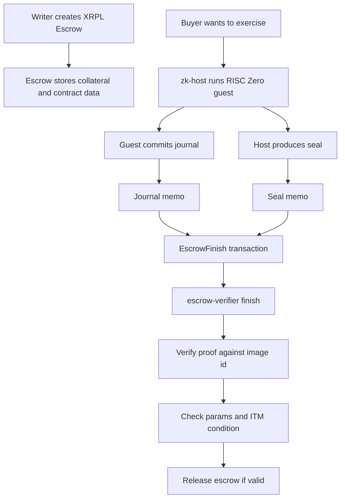
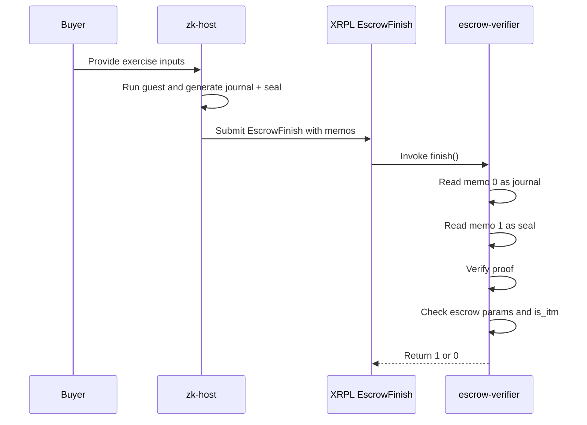

# Contracts

This directory contains the VeraFi contract-side implementation for the XRP hackathon demo.

It is the contract workspace for the XRPL smart escrow plus RISC Zero zkVM flow.
The goal of this folder is to make the demo understandable, testable, and runnable from one place.

## What is in here

### `zkvm/verafi-pricer/`
RISC Zero method builder plus guest code.

This is the proving side of the flow:
- the guest reads pricing inputs
- computes the option result
- commits the journal values that later get verified

### `zk-host/`
Local prover runner.

This is used to:
- execute the guest with real inputs
- generate the journal
- generate the seal
- print memo payloads that can be attached to XRPL transactions

### `escrow-verifier/`
XRPL Wasm verifier contract.

This is the on-chain side of the flow:
- reads memo payloads from the transaction
- parses the journal layout
- verifies the RISC Zero proof against the image id
- checks the escrow release condition
- returns `1` only when verification and release checks pass

### `tests/fixtures/`
Canonical byte fixtures used to keep contract-side encoding stable.

These fixtures help verify that:
- escrow data bytes match expectations
- journal bytes match expectations
- parser assumptions stay aligned with the actual contract flow

## Demo flow



## Verification logic



## Install and run

### Prerequisites
You need these installed on the machine:
- Rust toolchain
- Cargo
- Docker
- RISC Zero toolchain support required by the prover path

### Build the workspace
From the repo root:

```bash
cd contracts
cargo build
```

### Run verifier tests

```bash
cd contracts
cargo test -p verafi-escrow-verifier
```

### Generate a proof locally
This runs the host, executes the guest, and emits journal plus seal payloads:

```bash
cd contracts
cargo run -p verafi-zk-host -- 1400000 1150000 4300 0 2592000 1
```

Parameter order:
- `spot`
- `strike`
- `vol`
- `risk_free_rate`
- `expiry`
- `is_call`

### Build the XRPL verifier Wasm

```bash
cd contracts/escrow-verifier
cargo build --target wasm32v1-none --release
```

### Contract deploy path
The deploy path is:
1. build the verifier Wasm
2. upload the Wasm to groth5 using the XRPL smart contract flow
3. capture the deployed Wasm reference used by `FinishFunction`
4. create `EscrowCreate` with:
   - `Destination = buyer`
   - `Data = encoded escrow bytes`
   - `FinishFunction = uploaded Wasm reference`
5. later submit `EscrowFinish` with journal and seal memos

### Important deploy note
Wallet signing and transaction submission on groth5 are still part of the real deployment path.
For the demo flow, Otsu is the primary wallet and the signed transaction is submitted to groth5.

## Current implementation status

Working in this repo now:
- zkVM workspace is ported
- guest is ported
- host is ported
- escrow verifier is ported
- fixture files are ported
- verifier tests are passing in this repo

## What still needs to be completed

For full live demo readiness, this folder still needs:
- any remaining contract-support files required to operate only from `contracts/`
- repo-side validation of the full workspace build
- repo-side proof generation run from `zk-host`
- final groth5 deploy and transaction execution path

## How to think about the architecture

This is a bilateral option flow:
- writer creates the escrow and locks collateral
- buyer is the destination
- buyer exercises by submitting proof memos
- verifier checks proof plus release condition

The release rule is effectively:
- escrow params must match agreed bytes
- option must be in the money

## Important note

This folder is the contract source of truth for the demo path.
Frontend work should align to the byte layouts, proof inputs, and verifier behavior defined here.
