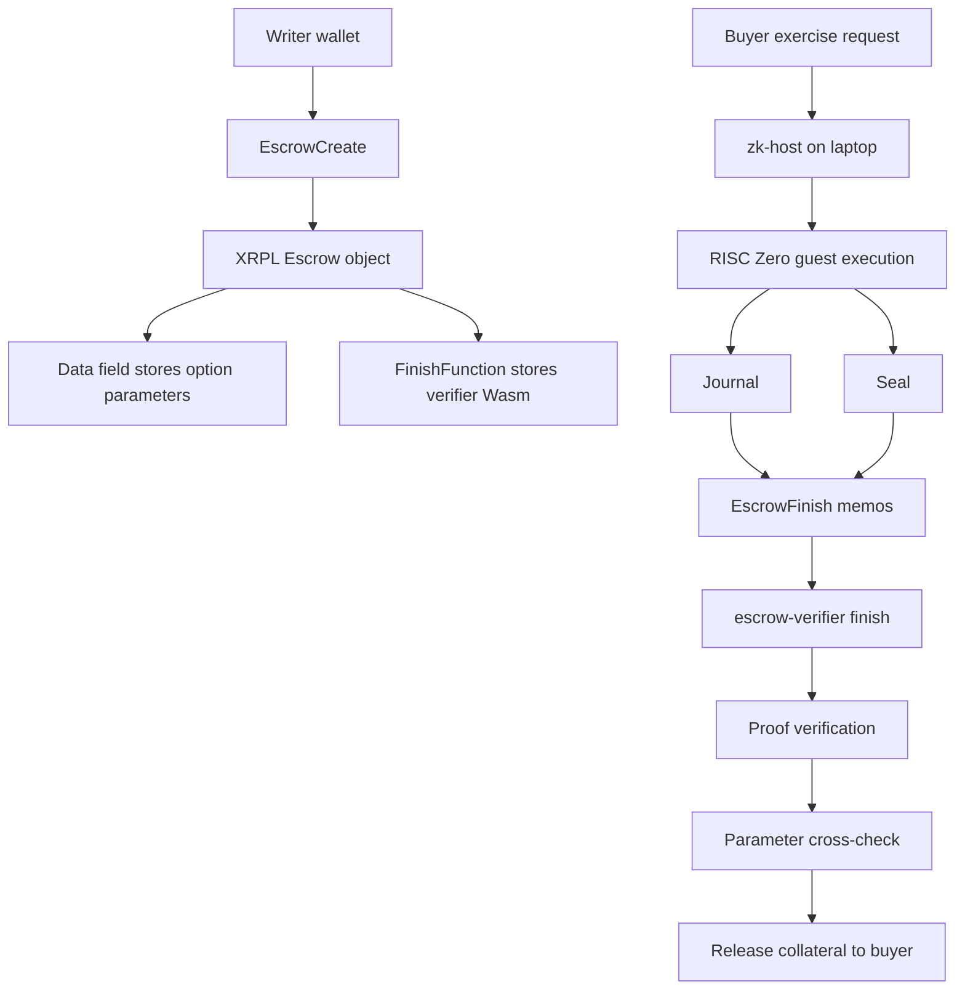
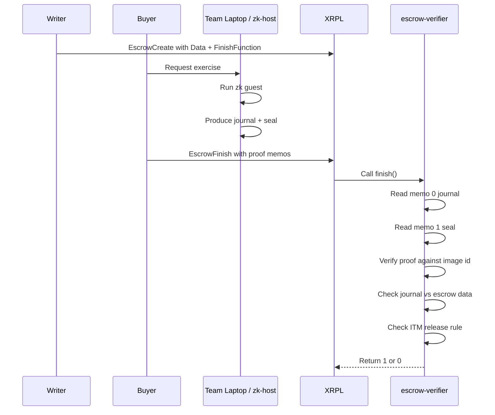

# Contracts

This directory is the full contract-side workspace for the VeraFi demo.

It contains the code and runbook for:
- compiling the XRPL Wasm verifier
- generating real RISC Zero proof artifacts
- preparing the `EscrowCreate` payload
- preparing the `EscrowFinish` payload
- running the live demo from a laptop on groth5

The intended audience for this README is the hackathon team during judging.
The goal is that a teammate can open this folder on their laptop, follow the steps, and understand exactly what each part does.

## Architecture overview

VeraFi uses an XRPL smart escrow as the on-chain settlement primitive and a RISC Zero zkVM proof as the exercise condition.

The high-level flow is:
1. the writer creates an escrow and locks collateral
2. the escrow stores the agreed option parameters in the XRPL `Data` field
3. the escrow points to a Wasm verifier through `FinishFunction`
4. when the buyer wants to exercise, the local prover generates a journal and seal
5. the buyer submits `EscrowFinish` with the proof payload in memos
6. the Wasm verifier checks the proof and release condition on-chain
7. if valid, the escrow releases funds to the buyer

## Contract directory layout

### `Cargo.toml`
Workspace root for the contract-side crates.

### `zkvm/verafi-pricer/`
RISC Zero method builder and guest package.

This section is responsible for the proving logic.
The guest:
- reads the option inputs
- computes the option result
- commits the public journal values

### `zk-host/`
Local prover runner.

This binary:
- executes the guest with real inputs
- prints the RISC Zero image id
- emits the journal hex
- emits the seal hex
- prints memo objects for `EscrowFinish`

### `escrow-verifier/`
XRPL Wasm verifier contract.

This contract:
- reads proof memos from the finishing transaction
- parses the journal bytes
- checks the RISC Zero proof against the image id
- checks that journal parameters match escrow `Data`
- checks that the exercise condition is valid
- returns `1` only when release is allowed

### `specs/`
Canonical byte-layout and verification references.

These files define the contract-side format for:
- escrow data encoding
- journal encoding
- real runtime journal layout
- proof verification interface

### `tests/fixtures/`
Known-good fixture payloads.

These files provide stable fixture data for:
- escrow bytes
- journal bytes

### `tests/byte-layout/`
Manual verification helpers for byte-level debugging.

### `tests/integration/`
Demo and live-run checklists for groth5.

### `justfile`
Shortcuts for repeated contract-side tasks.

## Demo architecture diagram



## Verification sequence diagram



## Supported option model in this directory

Current contract-side assumptions:
- bilateral writer and buyer flow
- collateral locked by writer in XRP
- buyer is the `Destination`
- proof memos are submitted in `EscrowFinish`
- little-endian byte encoding
- release condition is based on matching parameters and an in-the-money result

## Dependencies

A teammate running this locally should have:
- Rust installed
- Cargo installed
- Docker installed and running
- Python 3 installed
- a browser with Otsu Wallet loaded for the groth5 live step
- access to groth5-funded accounts for the writer and buyer

## Toolchain setup

### 1. Install Rust
Recommended:

```bash
curl https://sh.rustup.rs -sSf | sh
rustup default stable
rustup target add wasm32v1-none
```

### 2. Check Rust tools

```bash
rustc --version
cargo --version
```

### 3. Start Docker
RISC Zero proving depends on the local environment being ready.
Make sure Docker Desktop or the Docker daemon is running before the proving step.

### 4. Optional quick check
From the repository root:

```bash
cd contracts
cargo check
```

## Build steps

### Build the entire contract workspace
From the repository root:

```bash
cd contracts
cargo build
```

This builds:
- the verifier crate
- the zk host
- the builder crate
- the guest dependencies

### Build the verifier Wasm for XRPL

```bash
cd contracts
cargo build -p verafi-escrow-verifier --target wasm32v1-none --release
```

Expected artifact:

```bash
contracts/target/wasm32v1-none/release/verafi_escrow_verifier.wasm
```

## Test steps

### Run verifier tests

```bash
cd contracts
cargo test -p verafi-escrow-verifier
```

These tests validate:
- journal parsing
- real runtime journal parsing
- escrow data parsing
- cross-check logic
- release-condition logic
- proof error handling for empty seals

### Run full workspace tests

```bash
cd contracts
cargo test
```

## Proof generation steps

### Generate a real proof locally
From the repository root:

```bash
cd contracts
cargo run -p verafi-zk-host -- 1400000 1150000 4300 0 2592000 1
```

Argument order:
1. `spot`
2. `strike`
3. `vol`
4. `risk_free_rate`
5. `expiry`
6. `is_call`

Example values above mean:
- spot = `1.40`
- strike = `1.15`
- vol = `4300`
- rate = `0`
- expiry = `2592000`
- is_call = `1`

### Expected zk-host output
The host prints:
- the RISC Zero image id
- the journal hex
- the seal hex
- memo objects ready for `EscrowFinish`

Those outputs are required for the live demo.

## Extract the `FinishFunction` value

The `FinishFunction` for `EscrowCreate` is the hex-encoded Wasm binary.

### Build the Wasm

```bash
cd contracts
cargo build -p verafi-escrow-verifier --target wasm32v1-none --release
```

### Convert the Wasm file to hex

```bash
python3 - <<'PY'
from pathlib import Path
p = Path('contracts/target/wasm32v1-none/release/verafi_escrow_verifier.wasm')
print(p.read_bytes().hex())
PY
```

The output of that command is the value used in:
- `EscrowCreate.FinishFunction`

## Byte encoding used by the contract

### Escrow `Data` field
Current canonical encoding for the demo case:
- strike = `1_150_000`
- is_call = `1`
- expiry = `2_592_000`

Expected little-endian hex:

```text
308c11000000000001008d270000000000
```

### Journal payload
The verifier currently supports the real runtime journal layout used by the local proof path.
The real runtime journal length is:
- `44 bytes`

## Live demo prerequisites

Before trying a live demo on groth5, confirm these are ready:
- writer wallet exists and is funded
- buyer wallet exists and is funded
- writer wallet is the one signing `EscrowCreate`
- buyer wallet is the one submitting `EscrowFinish`
- Otsu is configured for groth5
- blind signing is enabled in Otsu
- the verifier Wasm is compiled
- `FinishFunction` hex has been extracted
- local host run has produced journal and seal

## Known demo wallet addresses

Current addresses discussed for the demo:
- buyer: `r8D5rp5cn2hkemoLKvoEJFNZ73Mp2Mcgr`
- writer: `rht5xsioM3iix1hx4i2zJX2WJ1JDTwLGJe`

These still need to match the actual wallets used during signing.

## EscrowCreate payload template

```json
{
  "TransactionType": "EscrowCreate",
  "Account": "<WRITER_ADDRESS>",
  "Amount": "100000000",
  "Destination": "<BUYER_ADDRESS>",
  "CancelAfter": "<RIPPLE_EPOCH_TIME>",
  "FinishFunction": "<HEX_ENCODED_WASM>",
  "Data": "308c11000000000001008d270000000000"
}
```

Notes:
- `Amount` above is 100 XRP in drops
- `Destination` must be the buyer
- `FinishFunction` must be the verifier Wasm hex
- `Data` must match the agreed byte format

## EscrowFinish payload template

```json
{
  "TransactionType": "EscrowFinish",
  "Account": "<BUYER_ADDRESS>",
  "Owner": "<WRITER_ADDRESS>",
  "OfferSequence": "<ESCROW_SEQUENCE>",
  "ComputationAllowance": 1000000,
  "Memos": [
    {
      "Memo": {
        "MemoData": "<JOURNAL_HEX>"
      }
    },
    {
      "Memo": {
        "MemoData": "<SEAL_HEX>"
      }
    }
  ]
}
```

## Full laptop demo procedure

### Phase 1. Build everything

```bash
cd contracts
cargo build
cargo build -p verafi-escrow-verifier --target wasm32v1-none --release
cargo test -p verafi-escrow-verifier
```

### Phase 2. Generate proof artifacts

```bash
cd contracts
cargo run -p verafi-zk-host -- 1400000 1150000 4300 0 2592000 1
```

Save these outputs:
- image id
- journal hex
- seal hex

### Phase 3. Extract `FinishFunction`

```bash
python3 - <<'PY'
from pathlib import Path
p = Path('contracts/target/wasm32v1-none/release/verafi_escrow_verifier.wasm')
print(p.read_bytes().hex())
PY
```

Save that output as:
- `FinishFunction`

### Phase 4. Configure wallet and network
- open Otsu
- switch to groth5
- confirm writer address
- confirm buyer address
- ensure both accounts are funded
- enable blind signing

### Phase 5. Create escrow on groth5
Submit `EscrowCreate` using:
- writer as `Account`
- buyer as `Destination`
- collateral in drops
- `Data` hex from this README
- `FinishFunction` from the compiled Wasm

When this transaction succeeds, record:
- transaction hash
- offer sequence
- cancel time used

### Phase 6. Exercise escrow on groth5
Submit `EscrowFinish` using:
- buyer as signer
- writer as `Owner`
- offer sequence from the create transaction
- `ComputationAllowance`
- journal memo
- seal memo

When this transaction succeeds, record:
- transaction hash
- final result code
- whether release happened

## Demo checklist for judges

During the live demo, be ready to show:
1. the verifier Wasm build
2. the proof generation command
3. the generated journal and seal
4. the `FinishFunction` hex source
5. the `EscrowCreate` payload
6. the `EscrowFinish` payload
7. the on-chain result on groth5 explorer

## Troubleshooting notes

### If proof generation fails
Check:
- Docker is running
- Rust target is installed
- dependencies are fully built

### If `EscrowCreate` fails
Check:
- writer wallet is funded
- `Destination` exists
- `FinishFunction` is valid Wasm hex
- `Data` hex is correct

### If `EscrowFinish` fails
Check:
- offer sequence is correct
- `Owner` is correct
- memos contain the correct journal and seal
- `ComputationAllowance` is present
- the proof matches the verifier image id

### If wallet signing is confusing
Use the writer wallet only for:
- `EscrowCreate`

Use the buyer wallet for:
- `EscrowFinish`

## Final note

This folder should be treated as the contract source of truth for the demo.
Any frontend integration should match the byte layouts, payloads, proof flow, and verifier behavior defined here.
