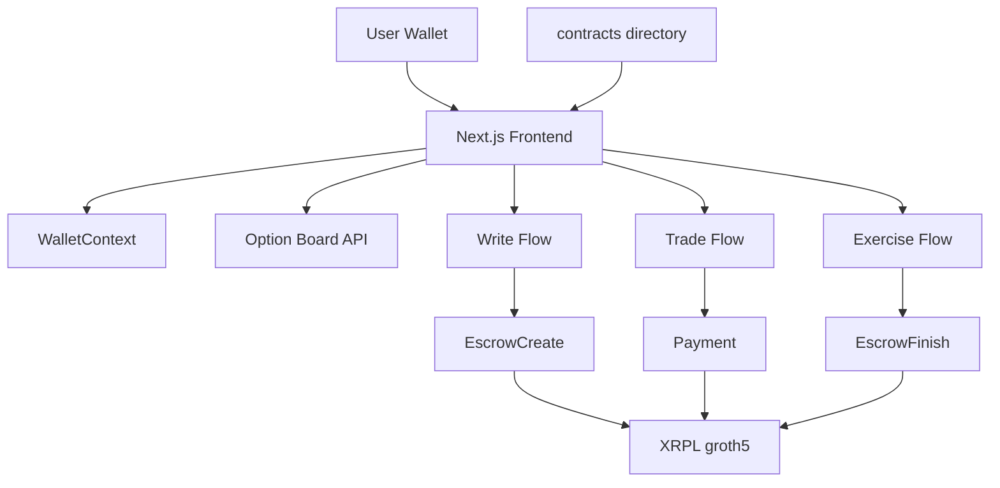
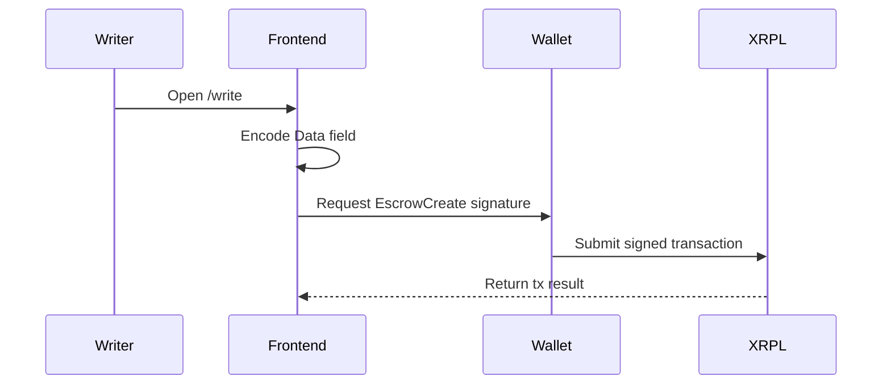

# Front End

This directory contains the VeraFi web application.

It is responsible for:
- wallet connection
- option board display
- premium payment flow
- writer-side escrow creation flow
- buyer-side escrow finish flow
- connecting the web app to the contract workflow defined in `../contracts/`

## Architecture overview

The frontend is a Next.js application that talks to XRPL groth5 and consumes the contract-side rules from the `contracts/` directory.



## Sequence flow



## Key folders

### `app/`
Next.js App Router pages.

Current important pages:
- `/` landing page
- `/login` wallet connect page
- `/board` option listings
- `/trade` premium payment flow
- `/write` writer-side escrow creation flow
- `/exercise` buyer-side escrow finish flow

### `components/`
UI and interaction components.

### `contexts/`
Global wallet connection state.

### `types/`
Shared frontend types and contract-related encoding helpers.

## Environment

Copy the example file and fill placeholders:

```bash
cp .env.example .env.local
```

Important variables:
- `NEXT_PUBLIC_XRPL_WSS`
- `NEXT_PUBLIC_XRPL_RPC`
- `NEXT_PUBLIC_XRPL_EXPLORER`
- `NEXT_PUBLIC_XRPL_NETWORK_ID`
- `NEXT_PUBLIC_FINISH_FUNCTION_HEX`
- `NEXT_PUBLIC_DEFAULT_BUYER_ADDRESS`
- `NEXT_PUBLIC_DEFAULT_WRITER_ADDRESS`

## Install

```bash
cd front-end
npm install
```

## Run locally

```bash
npm run dev
```

Default local URL:
- `http://localhost:3000`

## Build

```bash
npm run build
```

## Current implemented flows

### Wallet connect
- Otsu supported
- Crossmark supported
- Xaman intentionally disabled unless API setup is added

### `/write`
Current `/write` supports:
- entering buyer address
- entering collateral
- entering strike
- selecting expiry
- selecting option type
- encoding the XRPL `Data` field
- preparing `EscrowCreate`
- wallet-backed `EscrowCreate` submission path

### `/trade`
Current `/trade` supports:
- quote request
- premium payment flow
- wallet-backed payment submission

### `/board`
Current `/board` supports:
- fetch real escrows from groth5 when present
- fallback to demo data when no real escrows are found

### `/exercise`
Current `/exercise` supports:
- entering writer owner address
- entering escrow offer sequence
- using journal hex
- pasting seal hex
- wallet-backed `EscrowFinish` submission path

## Relationship with `contracts/`

The frontend must stay aligned with `../contracts/` for:
- escrow `Data` field encoding
- proof payload expectations
- writer and buyer lifecycle
- `EscrowCreate` and `EscrowFinish` payload shape

## Current gaps

Still missing or incomplete:
- better live option ingestion without relying on demo fallback
- better proof artifact autofill from contract outputs
- more shared helpers between contract docs and frontend transaction builders

## Validation checklist

Before considering frontend changes correct, verify:
1. `npm install` succeeds
2. `npm run build` succeeds
3. wallet connection still works
4. `/write` renders and prepares the right payload
5. `/exercise` renders and prepares the right payload
6. `/trade` still builds and works
7. environment placeholders remain safe and non-secret
